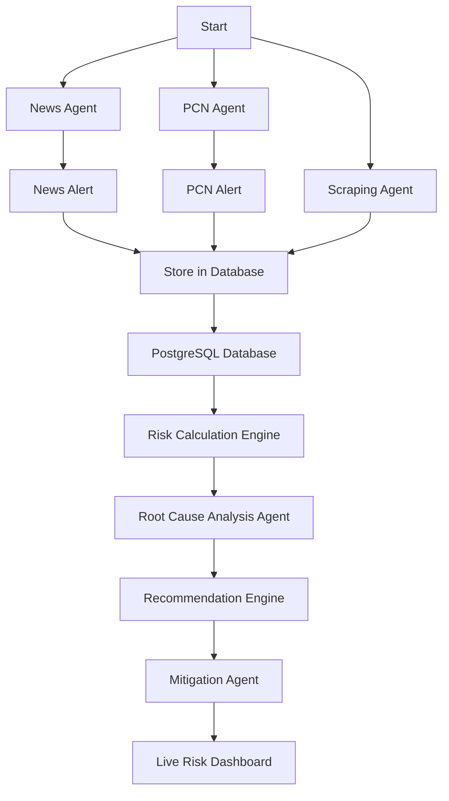

# SiaCore AI: Explainable & Proactive Supply Chain Risk Intelligence

**"Ancient Wisdom. Modern Intelligence."**

An AI-powered decision intelligence system for electronics supply chain risk management, connecting external disruption signals to your real-world supply chain.

---

## 🚀 Overview

**SiaCore AI** is an AI-driven supply chain risk intelligence platform designed to address component shortages, long lead times, supplier instability, and geopolitical disruptions.

Unlike traditional risk score generators that produce opaque metrics, SiaCore delivers **company-specific, graph-grounded, and explainable risk insights** with actionable mitigation plans.

---

## 🔍 The Problem vs. The SiaCore Solution

| Traditional Risk Management                                      | SiaCore AI Solution                                                                                           |
| ---------------------------------------------------------------- | ------------------------------------------------------------------------------------------------------------- |
| **Generic Risk Scores:** Opaque scores with limited context.     | **Component-Specific Risk Scoring:** Risk analysis tailored to each component, manufacturer, and distributor. |
| **One-Size-Fits-All Models:** Limited contextual awareness.      | **Company-Specific Analysis:** Uses inventory, BOM, ERP, and distributor data.                                |
| **Surface-Level Alerts:** Disconnected warnings.                 | **Graph-Grounded Reasoning:** Traces dependencies and identifies root causes.                                 |
| **Actionless Notifications:** Alerts requiring manual follow-up. | **Actionable Mitigation Plans:** Prioritized recommendations and mitigation actions.                          |

---

## 🛠️ How SiaCore Works

* **Automated Data Collection:** Collects inventory, BOM, distributor data, industry news, and Product Change Notifications (PCNs).
* **Entity Resolution:** Links external events to specific components, manufacturers, and distributors.
* **Inventory-Aware Risk Assessment:** Considers inventory levels, demand, BOM structures, and distributor capacity.
* **Root Cause Analysis:** Traces dependencies to identify the underlying causes of supply chain risks.
* **Explainable Recommendations:** Provides evidence-based explanations for risks along with recommended mitigation actions.

---

## 📊 Key Risk Dimensions

* **Part Risk** — Component vulnerabilities and obsolescence.
* **Manufacturer Risk** — Manufacturer stability and supply reliability.
* **Distributor Risk** — Stock availability and supply fluctuations.
* **Alternative Risk** — Availability and viability of alternative components.
* **Stock Risk** — Inventory depletion and stock gaps.
* **Inventory Risk** — Supply buffer versus production demand.
* **Compliance Risk** — Regulatory and standards changes.
* **PCN Risk** — Product Change Notifications and lifecycle changes.
* **News Risk** — Geopolitical and macroeconomic disruptions.

---

## 🏗️ System Architecture

---

## 🧰 Technology Stack

| Category                     | Technologies                                            |
| ---------------------------- | ------------------------------------------------------- |
| **Programming & Core Logic** | Python, Node.js                                         |
| **Backend & Database**       | PostgreSQL, LangGraph                                   |
| **Frontend**                 | React.js                                                |
| **AI & Intelligence**        | Multi-Agent Architecture, RAG, Graph-Grounded Reasoning |

---

## 👥 Project Team

* **Saja Rafat Gaber**
* **Nourhan Mohsen Mohammed**
* **Nada Ayman Shady**
* **Nada Emad Mahmoud**
* **Dina Ali Elharedy**
* **Marwa Ashraf Mohammed**

**Under the Supervision of:** Prof. Ghazal Abdelaty

**Institutions:**
NTI (National Telecommunication Institute) / Digilians / Ministry of Communications and Information Technology (Egypt)

---

## 🔮 Future Roadmap

* **Cost Optimization:** Intelligent and cost-efficient supply chain recommendations.
* **Historical News RAG:** Use historical disruption events for stronger risk analysis.
* **News Knowledge Graph:** Connect breaking news with relevant supply chain entities.
* **Graph-Based Reasoning:** Trace multi-tier supplier dependencies and hidden vulnerabilities.

---

## 📬 Contact & Inquiries

For more information about **SiaCore AI**, please feel free to reach out to the project team.
